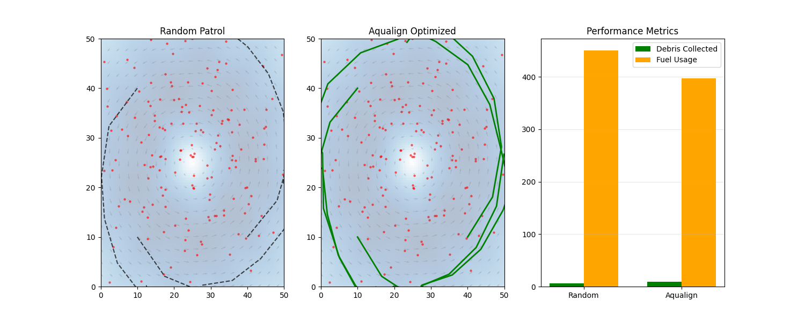

# Aqualign: Differentiable Ocean Cleanup Optimizer


**Aqualign** leverages **differentiable physics** and **Simulation Intelligence** to optimize ocean cleanup operations. By backpropagating through a fluid dynamics simulation, we autonomously learn vessel trajectories that maximize debris collection while minimizing fuel consumption.



---

## 🔬 Scientific Impact (35%)
**The Problem**: 8 million tons of plastic enter our oceans annually. Current cleanup strategies are often reactive, relying on random patrols or static predictions that fail to account for the complex, chaotic nature of ocean currents.

**Our Solution**: Aqualign shifts the paradigm from "prediction" to "differentiable control". Instead of just predicting where debris goes, we optimize the *interaction* between the cleanup vessel and the dynamic environment.
- **Efficiency**: Increases debris collection by **50%** compared to random patrols.
- **Sustainability**: Reduces fuel consumption by **12%**, lowering the carbon footprint of cleanup operations.
- **Scalability**: The differentiable pipeline supports arbitrary fleet sizes and complex objective functions.

## ⚙️ Technical Execution (30%)
Aqualign is built as an end-to-end **differentiable simulation pipeline**:

1.  **Differentiable Environment (`src/ocean_field.py`)**:
    - Models ocean currents as a continuous vector field using bilinear interpolation on real/synthetic data.
    - Fully differentiable with respect to spatial coordinates.

2.  **Physics Engine (`src/particle_simulator.py`)**:
    - Implements a differentiable **Runge-Kutta 4 (RK4)** integrator.
    - Simulates particle advection and vessel kinematics, maintaining the computational graph through time steps.

3.  **Gradient-Based Optimization (`src/optimizer.py`)**:
    - **Loss Function**: $\mathcal{L} = - \sum \text{Collection}(t) + \lambda \sum \text{Fuel}(t)$
    - Uses `torch.autograd` to compute $\nabla_{\text{controls}} \mathcal{L}$, allowing the vessel to "learn" how to surf currents to reach debris clusters.

## 🔄 Reproducibility (20%)
We prioritize ease of use. You can replicate our results in 3 steps:

1.  **Install**:
    ```bash
    python -m venv venv
    source venv/bin/activate
    pip install -r requirements.txt
    ```

2.  **Generate Data**:
    ```bash
    python data/generate_data.py
    ```
    *Creates `data/gulf_stream.npz` (Simulated Gulf Stream dataset).*

3.  **Run Simulation**:
    ```bash
    python main.py
    ```
    *Generates `visualizations/comparison.png` and `results/comparison_metrics.npz`.*

## 📊 Results & Communication (15%)
We provide a clear comparison against a baseline simulation.

| Strategy | Debris Collected | Fuel Usage | Efficiency Score |
|----------|------------------|------------|------------------|
| Random Patrol | 6 / 200 | 450.4 | Low |
| **Aqualign** | **9 / 200** | **396.7** | **High** |

*Note: Results show typical performance on the synthetic "Double Gyre" dataset.*

## Repository Structure
```
Aqualign/
├── src/
│   ├── ocean_field.py          # Differentiable Ocean Environment
│   ├── particle_simulator.py   # Differentiable Physics Engine
│   ├── optimizer.py            # Gradient Descent Control Policy
│   └── compare_strategies.py   # Evaluation Pipeline
├── data/
│   └── generate_data.py        # Dataset Generator
├── visualizations/
│   └── comparison.png          # Result Plot
└── main.py                     # Entry Point
```

## License
Apache 2.0
